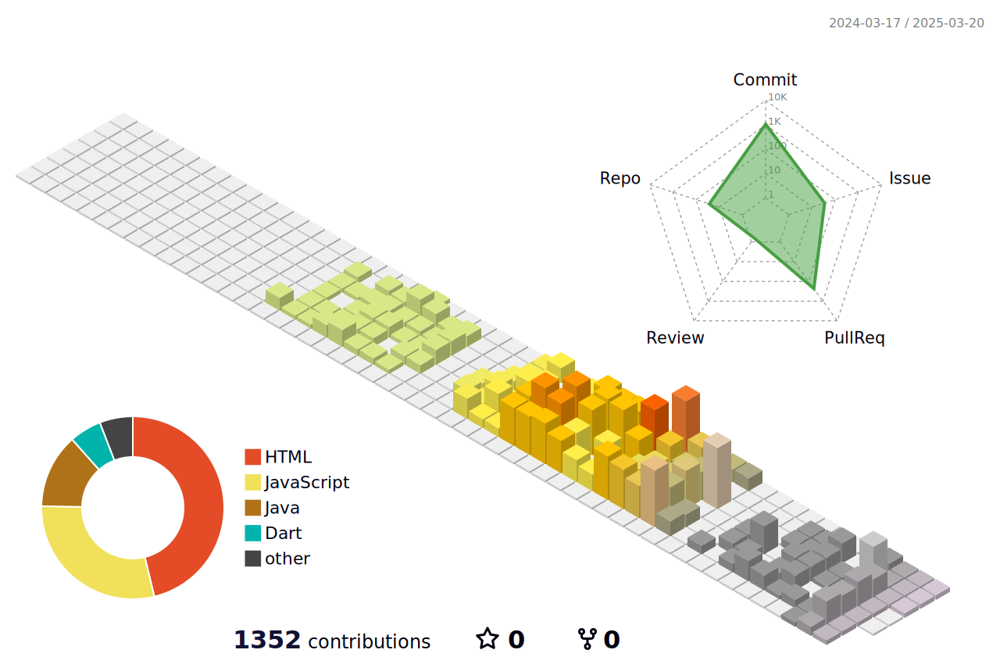

	
  
	

 
안녕하세요, 3D 애니메이터에서 개발자로 전향한 <strong> 박연화</strong>입니다.

 

 

	

  
 
  
  
    
    

 
 

## About Me
- 백엔드 개발자를 꿈꾸는 예비개발자입니다.
- Java를 중심으로 개발하며, 지금은 Flutter를 배우고 있어요.
- 독서 기록 앱 [Shelfy](https://github.com/ekkang2/shelfy_team_project) 프로젝트를 진행 중입니다.
 

## Stacks

 

    
 
          
          
          
          
	    	    
           
          
          
          
          
           
	  
             
          
          
          
           
          

    

 

## Tools

 

	
	
	
	 
	  
	
	

 

 

## Project Overview

| **작업 기한**        | **프로젝트 명**                     | **담당 파트**  |  **Repository**  | **비고**|
|-----------------|-------------------------------|-------|-------|-----------|
| 24.01.20 ~ 진행중 | Shelfy 독서 기록 앱 프로젝트 | 독서 기록 기능 | [Shelfy](https://github.com/ekkang2/shelfy_team_project) ||
| 24.11.16~24.12.26 | Plantry 그룹웨어 웹 프로젝트    | 팀장, 프로젝트 설정, 회원 기능 | [Plantry](https://github.com/subin3578/antwork) |[시연영상](https://www.youtube.com/watch?v=gYq8mfhy5Bk)|
| 24.10.18~24.11.15 | LotteOn 쇼핑몰 웹 프로젝트          | 장바구니, 주문 | [LotteOn](https://github.com/subin3578/TeamProject-LotteOn4) |[시연영상](https://www.youtube.com/watch?v=rM2Cj0PMg1Q&t=350s)|
| 24.09.27~24.10.04 | farmstory 농작물 거래 웹 프로젝트  | 회원 기능 | [farmstory](https://github.com/subin3578/farmstory_team3) ||

 

## GitHub Stats

 

 
Contect Me : ppyyhh3285@gamil.com

